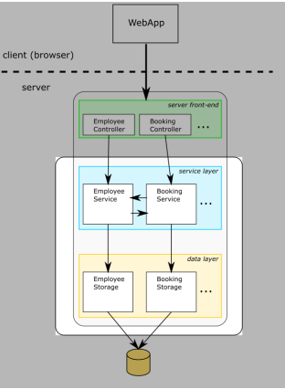
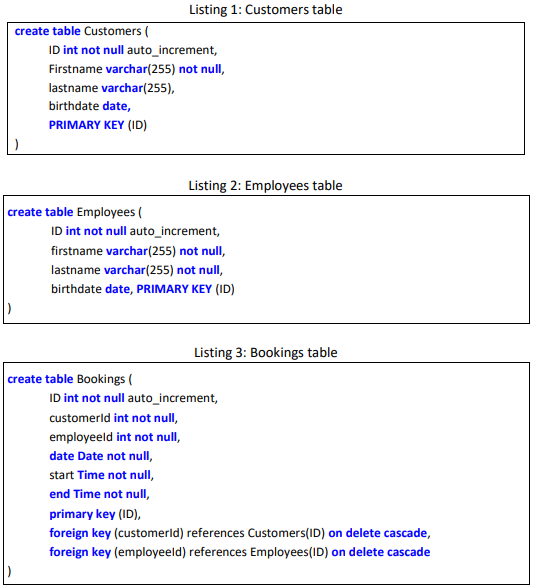

# Test Assignment - Booking System
### Hand in by
Anders Jacobsen, Dmitro Karaush

## 1 BOOKING SYSTEM
You are going to work on a skeleton of a simple booking system. The idea is for
customers to book appointments with an employee. The overview of the system is
illustrated below. For now, we ignore the greyed-out parts.

 

## 1.1 THE REPOSITORY
The project can be found at the following location: [https://github.com/mvdkcph/test2020fall-BookingSystem](https://github.com/mvdkcph/test2020fall-BookingSystem)

This repository was cloned and has been used to complete this assignment. 

## 1.2 THE DATABASE
Data is stored in a MySQL database with the following tables:

 

## 1.2.1 Running the MySQL server
If you don’t want to pollute your workstation with a MySql server installation, you can
easily run mysql in a docker container. That can be achieved by running the following
command.

```
docker run -d --rm \
--name mysql-test-db \
-e MYSQL_ROOT_PASSWORD=testuser123 \
-p 3307:3306 mysql
```

You are welcome to come up with a better and easier way to run the SQL server. For
example, you could look into testcontainers (https://www.testcontainers.org).

We used this approach towards testing.

## 1.3 TASK 1: ACQUIRE THE SYSTEM
Get the booking system. Create the database. Create the tables by running the scripts
above (in the repository, they are located under ```src/main/resources/db/migration/*.sql```).
For the rest of the tasks, you have to imagine that this system is now in production,
and the tables are filled with data.


## 1.4 TASK 2: IMPLEMENT REQUIREMENTS
**R1:** It must be possible to create customers, employees and bookings.
<br>

The option to create customers, employees and bookings has been implemented in the same 
style and architecture as in preexisting code and the system-skeleton in [section 1](#1-booking-system).
The files implemented can be found in these three folders: <br>
```src/main/java/dto``` <br>
```src/main/java/datalayer``` <br>
```src/main/java/servicelayer``` <br>

**R2:** A customer may have a phone number (this change requires a database migration
script).
<br>

The script for adding the column "phone" to an existing database can be found here: ```src/main/resources/db/migration/V4__add_column_phone_to_customers.sql```


**R3:** When booking an appointment with a customer, an SMS must be sent
(we only have the interface to the SMS service – imagine it’s being developed elsewhere.
But the behavior of calling the sms service must be verified in a unit test.)

Remember, because the system is already deployed in production (as we imagine), the
tables are already filled with data. This should be taken into account when adding a
phone number column: It must be added as a new migration script.

Since the interface we have received did not contain a "send" method, and we did 
not want to disregard the interface contract provided we decided to test only the 
methods provided with the interface. 

The test for the SMS interface can be found here: ```src/test/java/unit/dto/SmsMessageTest.java```

**Implement the following, with unit tests and integration tests:**

**Data layer**

All implementations below can be found here: ```src/main/java/datalayer```

All test for the implementations can be found here: ```src/test/java/integration/datalayer```
1. Create BookingStorage and BookingStorageImpl with methods
   - int createBooking(Booking booking)
   - Collection<Booking> getBookingsForCustomer(int customerId)
2. Create EmployeeStorage and EmployeeStorageImpl with methods
   - int createEmployee(Employee employee)
   - Collection<Employee> getEmployeeWithId(int employeeId)
   ***OBS*** this contract has been broken in implementation, this is due to unique ids causing maximum one result. Therefore the return type is ```Employee``` instead of ```Collection<Employee>```
   
**Service layer**

All implementations below can be found here: ```src/main/java/servicelayer```

All test for the implementations can be found here: ```src/test/java/integration/servicelayer``` and here: ```src/test/java/unit/servicelayer```
1. Create BookingService and BookingServiceImpl with methods
   - int createBooking(customerId, employeeId, date, start, end)
   - Collection<Booking> getBookingsForCustomer(customerId)
   - Collection<Booking> getBookingsForEmployee(employeeId)
2. Create EmployeeService and EmployeeServiceImpl with methods
   - int createEmployee(employee)
   - Employee getEmployeeById(employeeId)

    
## Final Words
We know a lot more test scenarios exist in this software and its functionality, but 
time is a resource of which we do not have enough to go deeper in this assigment.


